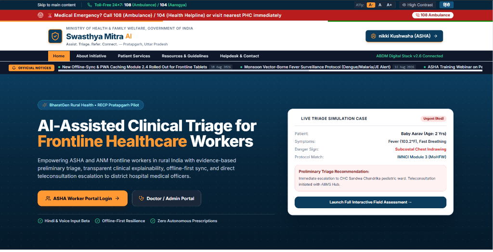
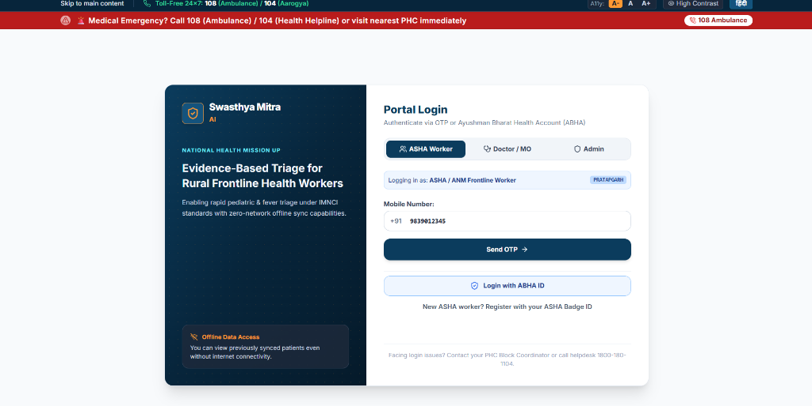
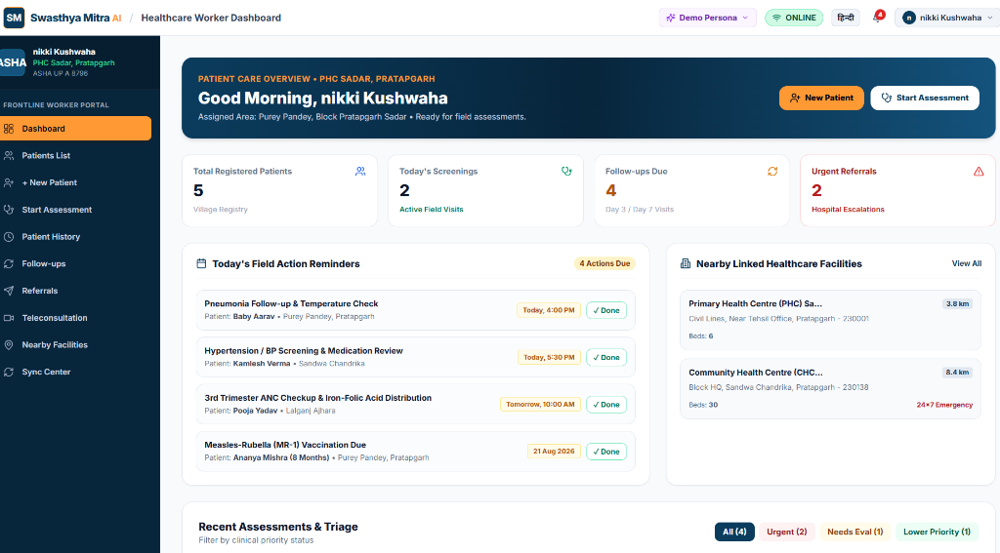
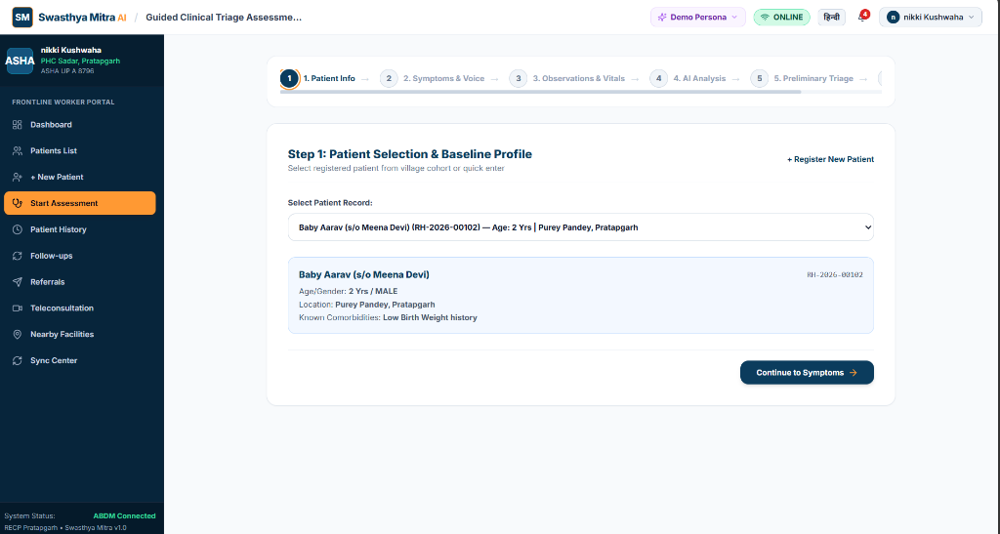
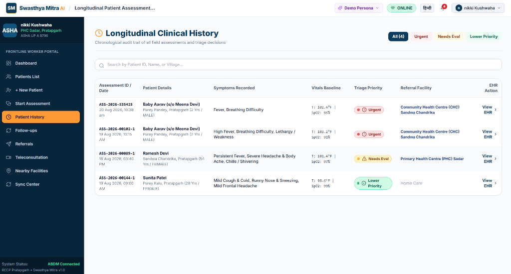

# Swasthya Mitra AI (स्वास्थ्य मित्र) 🏥
### BharatGen Rural Health & Triage Intelligence Platform

[](https://react.dev/)
[](https://www.typescriptlang.org/)
[](https://vitejs.dev/)
[](https://tailwindcss.com/)

**Swasthya Mitra AI** is an AI-powered rural healthcare decision-support and triage platform designed for frontline health workers (ASHA/ANM) and community health centers in India. It empowers rural medical teams with multilingual voice-assisted clinical triage, offline-first data synchronization, emergency protocol support, ABHA integration, and teleconsultation readiness.

---

## 🌟 Key Features

- **🎙️ Multilingual Voice & Clinical Triage**: Dynamic symptom screening with automated triage classification (Emergency 🔴, Urgent 🟡, Routine 🟢, Supportive ⚪).
- **🩺 Explainable AI Pipeline**: Detailed clinical reasoning with evidence mapping and protocol references tailored for rural practice.
- **📶 Offline-First Architecture**: Resilient local-storage queuing and seamless bi-directional synchronization with simulated intermittent connectivity.
- **📄 ABDM & ABHA Compliant**: Standardized digital health record generation with QR code-ready referral slips.
- **📱 Teleconsultation Hub**: Connect frontline health workers directly with district hospital doctors and specialists.
- **♿ Inclusive Accessibility**: Native support for multilingual translation (English, Hindi, Bhojpuri, Marathi, etc.), text-to-speech audio reader, font-scaling, and high-contrast modes.

---

## 📸 Application Screenshots

### 1. Landing Page & Live Triage Simulation


### 2. Multi-Role Portal Authentication (ASHA / Doctor / Admin)


### 3. Frontline Healthcare Worker (ASHA) Dashboard


### 4. Guided Step-by-Step Clinical Triage Assessment


### 5. Longitudinal Clinical History & Patient EHR Audit Trail


---

## 🚀 Getting Started

### Prerequisites
- Node.js (v18.0 or later recommended)
- npm or yarn

### Installation

1. **Clone the repository:**
   ```bash
   git clone https://github.com/deepikamau9794-blip/SWASTHYA-MITRA-AI.git
   cd SWASTHYA-MITRA-AI
   ```

2. **Install dependencies:**
   ```bash
   npm install
   ```

3. **Start the development server:**
   ```bash
   npm run dev
   ```

4. **Build for production:**
   ```bash
   npm run build
   ```

---

## 📁 Project Structure

```text
src/
├── assets/          # Static icons and assets
├── components/      # UI Components (Assessment, Triage, Layout, Teleconsult, etc.)
├── context/         # React contexts (Auth, Language, Patient, Sync, Accessibility)
├── data/            # Mock medical knowledge base, mock facilities, translations
├── pages/           # Application views (Public, Worker, Doctor, Admin, Auth)
├── types/           # TypeScript data interfaces & schemas
├── App.tsx          # Root router & layout wrapper
└── main.tsx         # Application entry point
```

---

## 🇮🇳 Developed for Rural Healthcare Resilience
Built with love for rural India's healthcare warriors.
